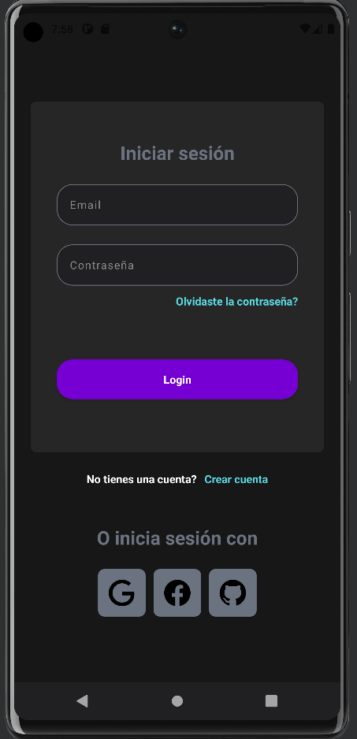
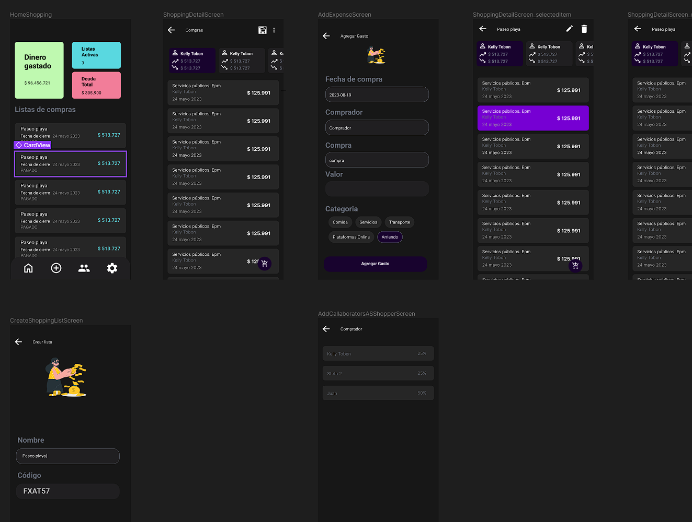

# ExpenseMate

Aplicación mobile para la gestión de gastos colaborativos e individuales. Especialmente util cuando compartimos cuentas o gastos con otras personas por motivos de: viajes grupales, encuentros de familia, gastos del hogar divididos, entre otros. 

## Sistema de versionado

En el siguiente link puedes encontrar más sobre el [sistema de versionado](https://github.com/InerxiaTI/expensapp/tree/master/docs/versionado) que estaremos usando. 

## ¿Cómo se ve la app?

Nuestro login en su primera versión luce así: 

Algunas de las pantallas principales: 

## ejecutar 
npx react-native run-android

## Configuraciones:

### Taildwind CSS
https://www.nativewind.dev/quick-starts/react-native-cli

## dribble inspiración 

https://dribbble.com/shots/20159263-Task-and-Project-Management-Mobile-App

